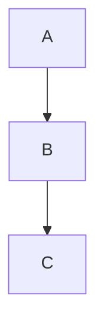

# Comparision between constructor call order in CPP and initializer call order in Python while Inheritance


## Inheritence 

  - In object-oriented programming, inheritance is the mechanism of basing an object or class upon another object (prototype-based inheritance) or class (class-based inheritance), retaining similar implementation.
  - Also defined as deriving new classes (sub classes) from existing ones (super class or base class) and forming them into a hierarchy of classes. 
  - In most class-based object-oriented languages, an object created through inheritance (a "child object") acquires all the properties and behaviors of the parent object (except: constructors, destructor, overloaded operators and friend functions of the base class). 
  - Inheritance allows programmers to create classes that are built upon existing classes,[1] to specify a new implementation while maintaining the same behaviors (realizing an interface), to reuse code and to independently extend original software via public classes and interfaces. 
  - suppose


## CPP

  - The constructors of inherited classes are called in the same order in which they are inherited.
  - Consider C inherits from B which inturn inherits from A
 
```cpp
#include<iostream> 
using namespace std; 

class A 
{ 
public: 
A() { cout << "A's constructor called" << endl; } 
}; 

class B 
{ 
public: 
B() { cout << "B's constructor called" << endl; } 
}; 

class C: public B, public A // Note the order 
{ 
public: 
C() { cout << "C's constructor called" << endl; } 
}; 

int main() 
{ 
	C c; 
	return 0; 
} 
```

Output:

```sh
B's constructor called
A's constructor called
C's constructor called
```
## Python
  - The initializer of parent class are not called automatically in python
  - initializer of only current class is called.
  - if you want to call parent's initializer, you will have to super(covered in next section)
  - Consider same cpp example
 
```python
# Program to define the use of super() 
# function in multiple inheritance 
class A: 
	def __init__(self): 
		print('A's initializer called.') 

	def foo(self, b): 
		print('Printing from class A:', b) 

class B(A): 
	def __init__(self): 
		print('B's initializer called.') 

	def foo(self, b): 
		print('Printing from class B:', b) 

class C(B):
	def __init__(self): 
		print('C's initializer called.') 

	def foo(self, b): 
		print('Printing from class C:', b) 

# main function 
if __name__ == '__main__': 
	obj = C() 
```
Output:
```sh
C's initializer called.
```

### super
  - [pointing to a great resource](https://realpython.com/python-super/)

License 
-------------
MIT
