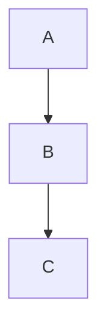

# Comparision between constructor call order in CPP and initializer call order in Python while Inheritance


## Introduction

  - This blog is about a specific behavior of classes in python.
  - if you have not gone through how to create the custom classes in python, please checkout this [wonderful resource](https://realpython.com/python3-object-oriented-programming/) for inheritence and [this](https://dbader.org/blog/python-dunder-methods) for polymorphism .  
  - consider below example for next sections


## CPP

  - The constructors of inherited classes are called in the same order in which they are inherited.
  - Consider C inherits from B which inturn inherits from A
 
```cpp
#include<iostream> 
using namespace std; 

class A 
{ 
public: 
A() { cout << "A's constructor called" << endl; } 
}; 

class B: public A
{ 
public: 
B() { cout << "B's constructor called" << endl; } 
}; 

class C: public B // Note the order 
{ 
public: 
C() { cout << "C's constructor called" << endl; } 
}; 

int main() 
{ 
	C c; 
	return 0; 
} 
```

Output:

```sh
A's constructor called
B's constructor called
C's constructor called
```
## Python
  - The initializer of parent class are not called automatically in python
  - initializer of only current class is called.
  - if you want to call parent's initializer, you will have to super(covered in next section)
  - Consider same cpp example
 
```python
# Program to define the use of super() 
# function in multiple inheritance 
class A: 
	def __init__(self): 
		print('A's initializer called.') 

	def foo(self, b): 
		print('Printing from class A:', b) 

class B(A): 
	def __init__(self): 
		print('B's initializer called.') 

	def foo(self, b): 
		print('Printing from class B:', b) 

class C(B):
	def __init__(self): 
		print('C's initializer called.') 

	def foo(self, b): 
		print('Printing from class C:', b) 

# main function 
if __name__ == '__main__': 
	obj = C() 
```
Output:
```sh
C's initializer called.
```

### super
  - [pointing to a great resource](https://realpython.com/python-super/)

License 
-------------
MIT
